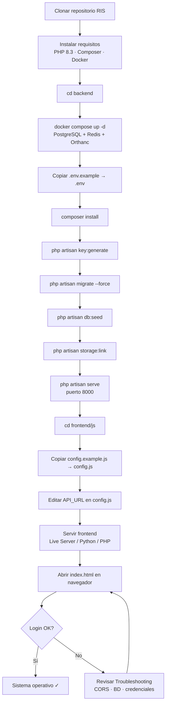
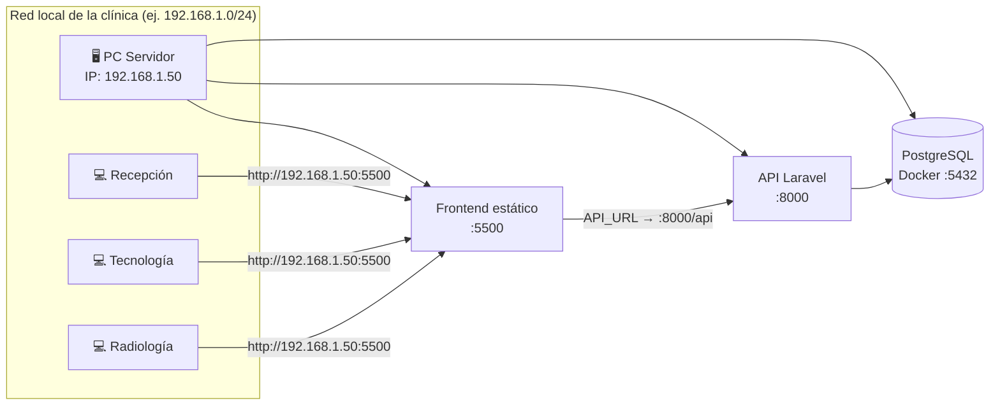

# RIS — Sistema de Información Radiológica

Aplicación web para gestión de agenda, worklist, informes, administración y pagos en centros de diagnóstico por imágenes.

| Componente | Tecnología |
|---|---|
| Backend API | Laravel 13 (PHP 8.3+) |
| Frontend | HTML + JavaScript + Bootstrap 5 |
| Base de datos | PostgreSQL 15 (recomendado) |
| Servicios opcionales | Redis, Orthanc (DICOM) |

---

## Requisitos previos

Instale lo siguiente **antes** de comenzar:

### En Windows y Linux

| Software | Versión mínima | Para qué sirve |
|---|---|---|
| **PHP** | 8.3 | API Laravel |
| **Composer** | 2.x | Dependencias PHP |
| **Docker** | Reciente | PostgreSQL, Redis y Orthanc |
| **Git** | Cualquiera | Clonar el repositorio |

Extensiones PHP necesarias: `pdo`, `pdo_pgsql`, `mbstring`, `openssl`, `tokenizer`, `xml`, `ctype`, `json`, `bcmath`, `fileinfo`.

> **Nota:** El frontend es estático (no requiere Node.js ni compilación). Solo necesita un servidor HTTP simple.

### Comprobar instalación

```bash
php -v          # Debe mostrar 8.3 o superior
composer -V
docker -v
docker compose version
```

---

## Diagrama de instalación

Visión general del proceso completo, desde cero hasta el primer login:



**Orden recomendado de terminales abiertas:**

| Terminal | Comando | Debe quedar corriendo |
|---|---|---|
| 1 | `docker compose up -d` (en `backend/`) | Sí (servicios en background) |
| 2 | `php artisan serve` (en `backend/`) | Sí |
| 3 | Servidor frontend (en `frontend/`) | Sí |

---

## Instalación paso a paso

### 1. Clonar el proyecto

```bash
git clone <url-del-repositorio> RIS
cd RIS
```

---

### 2. Levantar servicios con Docker

PostgreSQL (obligatorio) y Redis/Orthanc (opcionales) se levantan desde la carpeta `backend`:

```bash
cd backend
docker compose up -d
```

Verifique que los contenedores estén activos:

```bash
docker compose ps
```

Debería ver al menos el contenedor `pgsql` en estado **running**.

Credenciales por defecto de PostgreSQL (coinciden con `.env.example`):

| Variable | Valor |
|---|---|
| Base de datos | `ris_db` |
| Usuario | `risuserdb` |
| Contraseña | `GHeaO9jCWHO9LulGk8vbetnB` |
| Puerto | `5432` |

---

### 3. Configurar el backend (Laravel)

#### Windows (PowerShell)

```powershell
cd backend
Copy-Item .env.example .env
composer install
php artisan key:generate
php artisan migrate --force
php artisan db:seed
php artisan storage:link
php artisan serve --host=127.0.0.1 --port=8000
```

#### Linux / macOS

```bash
cd backend
cp .env.example .env
composer install
php artisan key:generate
php artisan migrate --force
php artisan db:seed
php artisan storage:link
php artisan serve --host=127.0.0.1 --port=8000
```

El API quedará disponible en: **http://127.0.0.1:8000**

> Deje esta terminal abierta mientras use el sistema. Para ejecutarlo en segundo plano en Linux puede usar `nohup` o un servicio systemd.

#### Variables importantes en `.env`

Revise que estos valores coincidan con su entorno:

```env
APP_URL=http://127.0.0.1:8000
FRONTEND_URL=http://127.0.0.1:5500

DB_CONNECTION=pgsql
DB_HOST=127.0.0.1
DB_PORT=5432
DB_DATABASE=ris_db
DB_USERNAME=risuserdb
DB_PASSWORD=GHeaO9jCWHO9LulGk8vbetnB
```

Si sirve el frontend desde otro puerto u host, actualice `FRONTEND_URL` para que CORS funcione correctamente.

---

### 4. Configurar el frontend

El frontend necesita saber dónde está la API.

#### Windows

```powershell
cd frontend\js
Copy-Item config.example.js config.js
```

#### Linux / macOS

```bash
cd frontend/js
cp config.example.js config.js
```

Edite `frontend/js/config.js`:

```javascript
const API_URL = 'http://127.0.0.1:8000/api';
```

> `config.js` no se versiona en git (contiene la URL de su entorno local).

---

### 5. Servir el frontend

Elija **una** de estas opciones:

#### Opción A — Extensión Live Server (VS Code / Cursor) — recomendada

1. Abra la carpeta `frontend` en el editor.
2. Clic derecho en `index.html` → **Open with Live Server**.
3. Se abrirá en `http://127.0.0.1:5500` (puerto ya permitido en CORS).

#### Opción B — Python (Windows y Linux)

```bash
cd frontend
python -m http.server 5500
```

Abra en el navegador: **http://127.0.0.1:5500/index.html**

#### Opción C — PHP embebido

```bash
cd frontend
php -S 127.0.0.1:5500
```

---

### 6. Primer acceso

1. Asegúrese de que el backend (`php artisan serve`) y el frontend estén corriendo.
2. Abra **http://127.0.0.1:5500/index.html**
3. Inicie sesión con un usuario del seeder.

Usuarios de prueba incluidos tras `php artisan db:seed`:

| Usuario | Rol | Notas |
|---|---|---|
| `admin` | Sys. Admin (`sis_admin`) | Acceso global a todos los laboratorios. **No aparece** en el listado de usuarios del módulo Admin. |
| `rgutierrez` | Administrador | Usuario operativo con múltiples roles de prueba. |
| `friquelme` | Tecnólogo | Usuario de ejemplo. |

Las contraseñas están definidas en `backend/database/seeders/DatabaseSeeder.php`. Para entornos nuevos, cambie las contraseñas desde Admin → Usuarios o con:

```bash
cd backend
php artisan tinker
>>> $u = \App\Models\User::where('username', 'rgutierrez')->first();
>>> $u->password = bcrypt('SuNuevaClave123');
>>> $u->save();
```

---

## Verificación rápida

Ejecute esta lista después de instalar:

- [ ] `docker compose ps` — PostgreSQL en **running**
- [ ] `php artisan migrate:status` — Todas las migraciones en **Ran**
- [ ] http://127.0.0.1:8000 — Responde (puede mostrar 404 en raíz; es normal)
- [ ] Login en el frontend funciona
- [ ] Selector de laboratorio visible en la barra superior
- [ ] Módulo **Agenda** carga citas y catálogo

### Probar la API manualmente

```bash
curl -X POST http://127.0.0.1:8000/api/login \
  -H "Content-Type: application/json" \
  -H "Accept: application/json" \
  -d "{\"login_field\":\"rgutierrez\",\"password\":\"SU_CLAVE\"}"
```

Debe devolver `"success": true` y un `access_token`.

---

## Despliegue en red local (LAN)

Use esta sección cuando el RIS debe ser accesible desde **otras computadoras de la clínica** (recepción, salas, radiología), no solo desde el servidor donde está instalado.

### Arquitectura en red

En una instalación típica, **una PC actúa como servidor** y el resto accede vía navegador:



> **Importante:** `config.js` debe usar la **IP del servidor**, no `127.0.0.1`. Desde otra PC, `127.0.0.1` apuntaría a esa PC del cliente, no al servidor.

---

### Paso 1 — Obtener la IP del servidor

Ejecute en la PC que será el servidor:

**Windows (PowerShell):**
```powershell
ipconfig
# Busque "IPv4" en su adaptador de red activo (Wi-Fi o Ethernet)
# Ejemplo: 192.168.1.50
```

**Linux:**
```bash
ip addr show
# o más simple:
hostname -I
```

Anote la IP fija o reservada en el router (recomendado para producción en clínica). En este ejemplo usamos **`192.168.1.50`**.

---

### Paso 2 — Configurar el backend para la red

Edite `backend/.env` en el servidor:

```env
APP_URL=http://192.168.1.50:8000
FRONTEND_URL=http://192.168.1.50:5500

DB_HOST=127.0.0.1
# DB_HOST sigue siendo 127.0.0.1 porque PostgreSQL corre en la misma máquina vía Docker
```

Limpie la caché de configuración:

```bash
cd backend
php artisan config:clear
```

Inicie el API escuchando en **todas las interfaces** (no solo localhost):

```bash
php artisan serve --host=0.0.0.0 --port=8000
```

---

### Paso 3 — Configurar el frontend para la red

Edite `frontend/js/config.js` en el servidor:

```javascript
const API_URL = 'http://192.168.1.50:8000/api';
```

Sirva el frontend también en todas las interfaces:

**Python (Windows y Linux):**
```bash
cd frontend
python -m http.server 5500 --bind 0.0.0.0
```

**PHP embebido:**
```bash
cd frontend
php -S 0.0.0.0:5500
```

> Si usa **Live Server** en el servidor, configure que escuche en `0.0.0.0` (en VS Code/Cursor: `"liveServer.host": "0.0.0.0"` en settings).

---

### Paso 4 — Abrir puertos en el firewall

El servidor debe permitir conexiones entrantes en los puertos **8000** (API) y **5500** (frontend).

**Windows — PowerShell como Administrador:**
```powershell
New-NetFirewallRule -DisplayName "RIS API" -Direction Inbound -Protocol TCP -LocalPort 8000 -Action Allow
New-NetFirewallRule -DisplayName "RIS Frontend" -Direction Inbound -Protocol TCP -LocalPort 5500 -Action Allow
```

**Linux (ufw):**
```bash
sudo ufw allow 8000/tcp
sudo ufw allow 5500/tcp
sudo ufw reload
```

PostgreSQL (`5432`) **no** debe exponerse a la red; solo el servidor local se conecta vía Docker.

---

### Paso 5 — Acceder desde otras PCs

En cualquier equipo de la clínica conectado a la misma red, abra el navegador en:

```
http://192.168.1.50:5500/index.html
```

No es necesario instalar nada en las PCs clientes: solo un navegador moderno (Chrome, Edge o Firefox).

**Checklist de acceso LAN:**

- [ ] Desde el servidor: `http://192.168.1.50:5500` abre el login
- [ ] Desde otra PC: misma URL abre el login
- [ ] Login completa sin error CORS (F12 → Console)
- [ ] Agenda carga datos tras seleccionar laboratorio

---

### Paso 6 — Comandos diarios en modo LAN

**Terminal 1 — Backend (servidor):**
```bash
cd backend
php artisan serve --host=0.0.0.0 --port=8000
```

**Terminal 2 — Frontend (servidor):**
```bash
cd frontend
python -m http.server 5500 --bind 0.0.0.0
```

**Docker (si no está levantado):**
```bash
cd backend
docker compose up -d
```

URL para compartir con el equipo: **`http://192.168.1.50:5500/index.html`**

---

### Producción en LAN — recomendaciones

| Tema | Recomendación |
|---|---|
| **IP del servidor** | Reservar IP fija en el router o asignar IP estática en Windows/Linux |
| **`php artisan serve`** | Adecuado para clínica pequeña / pruebas. Para uso intensivo, use Nginx o Apache como proxy inverso |
| **HTTPS** | En producción real, configure certificado (Let's Encrypt o interno) delante del frontend y API |
| **Backups** | Programe respaldo de volumen Docker `ris-db` y de `backend/storage` |
| **Contraseñas** | Cambie las del seeder antes de poner en operación |
| **Sys. Admin** | Reserve el usuario `admin` solo para soporte técnico; operadores usan cuentas `admin` de centro |

#### Ejemplo mínimo con Nginx (opcional, Linux)

Si prefiere un único puerto (80) en lugar de 5500 + 8000:

```nginx
server {
    listen 80;
    server_name 192.168.1.50;

    root /ruta/a/RIS/frontend;
    index index.html;

    location / {
        try_files $uri $uri/ /index.html;
    }

    location /api {
        proxy_pass http://127.0.0.1:8000;
        proxy_set_header Host $host;
        proxy_set_header X-Real-IP $remote_addr;
    }
}
```

En ese caso actualice `config.js` a `const API_URL = '/api';` (ruta relativa) y `FRONTEND_URL` en `.env` a `http://192.168.1.50`.

---

### Problemas frecuentes en LAN

| Síntoma | Causa probable | Solución |
|---|---|---|
| Otra PC no carga la página | Firewall bloqueando puerto | Revisar reglas puertos 5500 y 8000 |
| Login falla solo desde PCs remotas | `config.js` usa `127.0.0.1` | Cambiar a IP del servidor |
| Error CORS en consola | `FRONTEND_URL` incorrecto | Actualizar `.env` con `http://IP:5500` y `php artisan config:clear` |
| API responde en servidor pero no en red | `serve` atado a `127.0.0.1` | Usar `--host=0.0.0.0` |
| Conexión intermitente | IP del servidor cambió (DHCP) | Fijar IP en router o sistema operativo |

---

## Estructura del proyecto

```
RIS/
├── backend/                 # API Laravel
│   ├── app/                 # Controladores, modelos, servicios
│   ├── database/
│   │   ├── migrations/      # Esquema de BD
│   │   └── seeders/         # Datos iniciales de prueba
│   ├── routes/api.php       # Rutas REST
│   ├── docker-compose.yml   # PostgreSQL + Redis + Orthanc
│   └── .env.example         # Plantilla de configuración
│
└── frontend/                # SPA estática
    ├── index.html           # Pantalla de login
    ├── layout.html          # Shell principal (post-login)
    ├── pages/               # Vistas por módulo
    └── js/
        ├── config.example.js
        └── config.js        # ← Crear localmente (no versionado)
```

---

## Roles del sistema

| Rol | Acceso principal |
|---|---|
| **Sys. Admin** (`sis_admin`) | Visión global de todos los laboratorios, creación de matrices, acceso a todos los módulos |
| **Admin** | Configuración del centro, usuarios, catálogo, reportes |
| **Recepcionista** | Agenda, entrega de resultados |
| **Tecnólogo** | Worklist, adquisición |
| **Radiólogo** | Lectura e informe, validación |
| **Transcriptor** | Transcripción de informes |

### Sys. Admin — comportamiento especial

- Ve **todos** los laboratorios en el selector superior (opción "Visión Global").
- No está sujeto a filtros por sucursal en la API.
- **No aparece** en las listas de usuarios del módulo Administración (ni puede asignarse ese rol desde la interfaz).
- Para operar sobre un centro concreto (configuración, reportes filtrados), seleccione un laboratorio en el selector.

---

## Funcionalidades principales

- **Agenda** — Citación multipropósito, insumos, pagos, envío de instrucciones por correo al agendar (excepto procedencia Ambulatorio).
- **Worklist** — Flujo técnico y envío DICOM.
- **Radiólogo / Transcripción / Validación / Entrega** — Flujo completo del informe.
- **Administración** — Usuarios, salas, catálogo de exámenes (con instrucciones por correo), insumos, previsiones, reportes y nómina.
- **Multi-laboratorio** — Matriz + sucursales con contexto por `X-Lab-Id`.

---

## Correo electrónico (instrucciones al paciente)

Por defecto en local:

```env
MAIL_MAILER=log
```

Los correos se registran en `backend/storage/logs/laravel.log`.

Para envío real, configure SMTP en `.env`:

```env
MAIL_MAILER=smtp
MAIL_HOST=smtp.su-proveedor.com
MAIL_PORT=587
MAIL_USERNAME=usuario
MAIL_PASSWORD=clave
MAIL_ENCRYPTION=tls
MAIL_FROM_ADDRESS=noreply@su-centro.cl
MAIL_FROM_NAME="Centro de Diagnóstico"
```

Configure las instrucciones por examen en **Admin → Catálogo de Prestaciones → Editar examen**.

---

## Servicios Docker opcionales

| Servicio | Puerto | Uso |
|---|---|---|
| PostgreSQL | 5432 | Base de datos (requerido) |
| Redis | 6379 | Colas y sincronización en nube |
| Orthanc | 8042 (web), 4242 (DICOM) | PACS local para pruebas DICOM |

Para detener todo:

```bash
cd backend
docker compose down
```

Para reiniciar desde cero (⚠️ borra datos de BD):

```bash
docker compose down -v
docker compose up -d
php artisan migrate --force
php artisan db:seed
```

---

## Solución de problemas

### "No se pudo conectar con el servidor" (login)

1. Verifique que `php artisan serve` esté corriendo.
2. Confirme que `frontend/js/config.js` apunta a `http://127.0.0.1:8000/api`.
3. Abra las herramientas de desarrollador del navegador (F12) → pestaña **Network** y revise errores CORS.

### Error CORS

Actualice `FRONTEND_URL` en `backend/.env` con la URL exacta desde la que abre el frontend (incluyendo puerto e IP de LAN si aplica), luego:

```bash
php artisan config:clear
```

En redes locales, el sistema acepta automáticamente orígenes en rangos privados (`192.168.x.x`, `10.x.x.x`, `172.16–31.x.x`). Si usa un dominio interno distinto, agréguelo manualmente en `backend/config/cors.php`.

### "Connection refused" a PostgreSQL

```bash
cd backend
docker compose down
docker compose up -d
# Espere 5–10 segundos y reintente:
php artisan migrate:status
```

### "No application encryption key"

```bash
cd backend
php artisan key:generate
php artisan config:clear
```

### "SQLSTATE[42P01]: Undefined table"

```bash
cd backend
php artisan migrate --force
```

### Login devuelve error de credenciales

- Verifique que ejecutó `php artisan db:seed`.
- Use el **username** (no necesariamente el email) para iniciar sesión.
- Restablezca la clave con `php artisan tinker` (ver sección Primer acceso).

### El frontend no refleja cambios en JS

Recargue con **Ctrl+F5** (forzar sin caché). Si usa Live Server, reinicie el servidor.

### Ver logs del backend

```bash
# Windows (PowerShell)
Get-Content backend\storage\logs\laravel.log -Wait -Tail 50

# Linux
tail -f backend/storage/logs/laravel.log
```

---

## Tests

```bash
cd backend
php artisan test
```

> Algunos tests pueden requerir ajustes según el estado del seeder. Use los tests como referencia, no como gate único de despliegue local.

---

## Resumen de comandos diarios

### Solo en el servidor (localhost)

Terminal 1 — Backend:

```bash
cd backend
php artisan serve --host=127.0.0.1 --port=8000
```

Terminal 2 — Frontend:

```bash
cd frontend
python -m http.server 5500
```

Acceso: **http://127.0.0.1:5500/index.html**

### Red local (varias PCs en la clínica)

Use `--host=0.0.0.0` y `--bind 0.0.0.0` como se describe en [Despliegue en red local (LAN)](#despliegue-en-red-local-lan).

Acceso desde cualquier PC: **`http://<IP-DEL-SERVIDOR>:5500/index.html`**

### Docker (ambos modos)

```bash
cd backend
docker compose up -d
```

---

## Licencia

Proyecto de uso interno — licencia privada.

---

**Versión:** 1.0.0  
**Última actualización:** Mayo 2026
